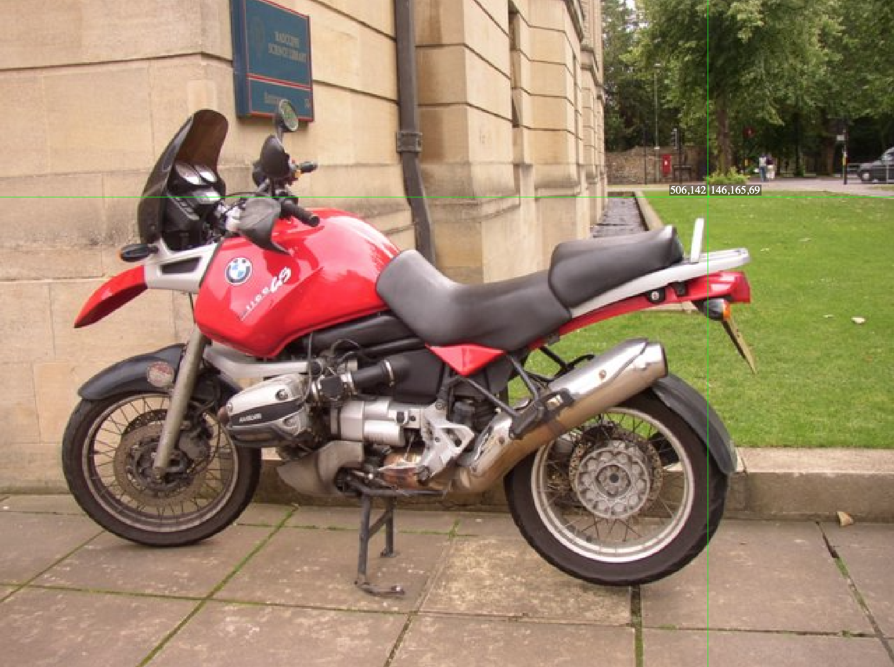

---
jupytext:
  formats: md:myst
  text_representation:
    extension: .md
    format_name: myst
rise:
  start_slideshow_at: beginning

kernelspec:
  display_name: Python 3
  language: python
  name: python3
---

# 期末大作业I #

## 任务一：描述图片 ##

打开https://pixspy.com/，上传任意一张照片。鼠标在图片上移动，观察鼠标旁的数字，回答以下问题：



1. 鼠标旁的五个数字分别代表图片的什么信息？
2. 图片的分辨率是多少？
3. 图片左上角的行下标和列下标分别是多少？
4. 图片最右处的列下标是多少？
5. 图片最底部的行下标是多少？
6. 行下标是从左往右增大，还是从上到下增大？
7. 用鼠标滚轮放大图片，直到看到一个个"马赛克"为止。它们其实是像素，当像素放大到一定程度，看起来就像是小色块。这叫做图像的像素化（pixelation）。

## 任务二：输出图像信息 ##

下面是一张海滩的图片，我们用以下代码来打印图片的信息：


```{code-cell} python3
import cv2
img = cv2.imread('beach.jpeg') 

totalCol= img.shape[1]  #image width
totalRow= img.shape[0] #image height

print(totalCol, totalRow) #print image width and height

for i in range(4):
  for j in range(4):
    print(img[i,j])    #打印图片的[B,G,R]信息
```
1. 这16个像素点在图片的哪个位置？
2. 为什么这些像素点的值都比较小？

OpenCV对图像是用**BGR**（不是RGB)的方式来进行编码的。每个像素值都是一个包含三个元素列表，分别对应Blue, Green和Red。所以你如果想要获得某个位置像素点的三原色值，你也可以通过列表下标的方式来得到，例如：

```{code-cell} python3
import cv2
img = cv2.imread('beach.jpeg') 

print(img[100,100,0])    #输出图片的[100,100]处的蓝色值
print(img[100,100,1])    #输出图片的[100,100]处的绿色值
print(img[100,100,2])    #输出图片的[100,100]处的红色值

```

## 任务三：去除蓝色 ##

即使一张图片由上百万个像素点组成，计算机仍然能够在你喝一口水的时间内，对它们全部进行处理。这个任务中你将要编写三个函数，来实现一些神奇的效果。

如果将图片中的所有蓝色值全变成0，你会看到一副怎样的画面？你还会看到沙滩吗？

运行下面程序之后，

```{code-cell} python3
import cv2
from IPython.display import Image

def zeroBlue(img):
  img_width = img.shape[1]  
  img_height = img.shape[0] 
  for row in range(img_height):
    for col in range(img_width):
      img[row][col][0] = 0
  return img

img = cv2.imread('beach.jpeg')
newImage = zeroBlue(img)
cv2.imwrite("1.png", newImage)
Image(filename='1.png') 
```

其中程序第二行和最后一行是为了在课程网站中展示图片而添加，在PyCharm中你需要删除这两行。

## 提交 ##

下面四个任务需要自己完成并提交：

1. 设计函数onlyBlue，使图片只保留蓝色，也就是将红色和绿色值全置为0。
2. 设计函数negate，将图片像素值翻转。为了翻转图片，需要将红色值置为255-红色值，绿色值置为255-绿色值，蓝色值置为255-蓝色值。
3. 设计函数grayscale，将图片变为灰度图，需要将像素点的三种颜色值均置为它们的平均值。
4. [附加任务]设计fixUnderWater函数，使得海水中的鱼更容易被看到。
