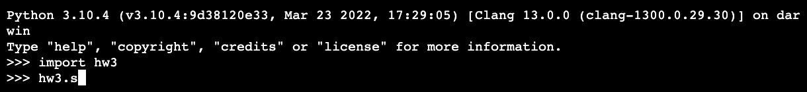

.. _hw3:

Problem Set 3
======================

Distance
----------------

Write a function called s1() that prompts the user to enter two points on the Cartesian plane with different coordinates and calculates the slope between the two points and the distance between the two points. The formulas for both of these quantities are as follows between points (x1,y1) and (x2,y2):

.. math::

    slope = \frac{y_{2}-y_{1}}{x_{2}-x_{1}}

    dist =  \sqrt{(y_{2}-y_{1})^2 + (x_{2}-x_{1})^2}

For example, if you have two points: (1,1) and (2,2), the slope and distance between the two points should be 1 and 1.4.

When you call s1(), the output should be like this:

Universal Gravitation
----------------
The force of gravity, or gravitational force, pulls objects with mass toward each other. We often think about the force of gravity from Earth. This force is what keeps your body on the ground. But any object with mass exerts a gravitational force on all other objects with mass.

The gravitational force between two objects is larger when the masses of the objects are larger. That’s why you can feel the gravitational force between you and Earth, but the force between you and objects with smaller masses is too weak to feel.

The gravitational force between two objects also depends on the distance between their centers. The further objects are from one another, the weaker the force is.

The equation for gravitation force thus takes the form:

.. math::

    F = G\frac{m1m2}{r^2}

where

* F: gravitational force acting between two objects
* m1 and m2: the masses of the objects
* r: the distance between the centers of their masses.

G is the gravitational constant, which is :math:`6.67*10^{-11} m^3.kg^{-1}.s^{-2}`

Write a function called s2() that prompts the user to enter the masses of two objects(for example, two stars), and the distance between them. Then it should calculate the gravitational force. When you call s2(), the output should be like this:

.. image:: s2.gif
  :width: 750

Solve Equation
----------------

Write a function called solve() to solve quadratic equation: :math:`ax^2+bx+c=0`

When you call solve(), the output should be like this:

.. image:: solve.gif
  :width: 750

Lottery
-------

Most lotteries allow users to choose some balls painted in different numbers, out of the box. If the user choose all the balls correctly, then he/she wins the lottery.

Write a method gamble() to calculate a person’s chance of winning a lottery. The number of possible choices of balls is :math:`\frac{n!}{(n-k)! * k!}`, when the user is choosing k balls out of n. When you call gamble(), the output should be look like this:

.. image:: gamble.gif
  :width: 750

Submit:
-----------

Put the four functions into one python file, and share your project link via 钉钉作业本。Please submit by Oct 16th, 22PM.

