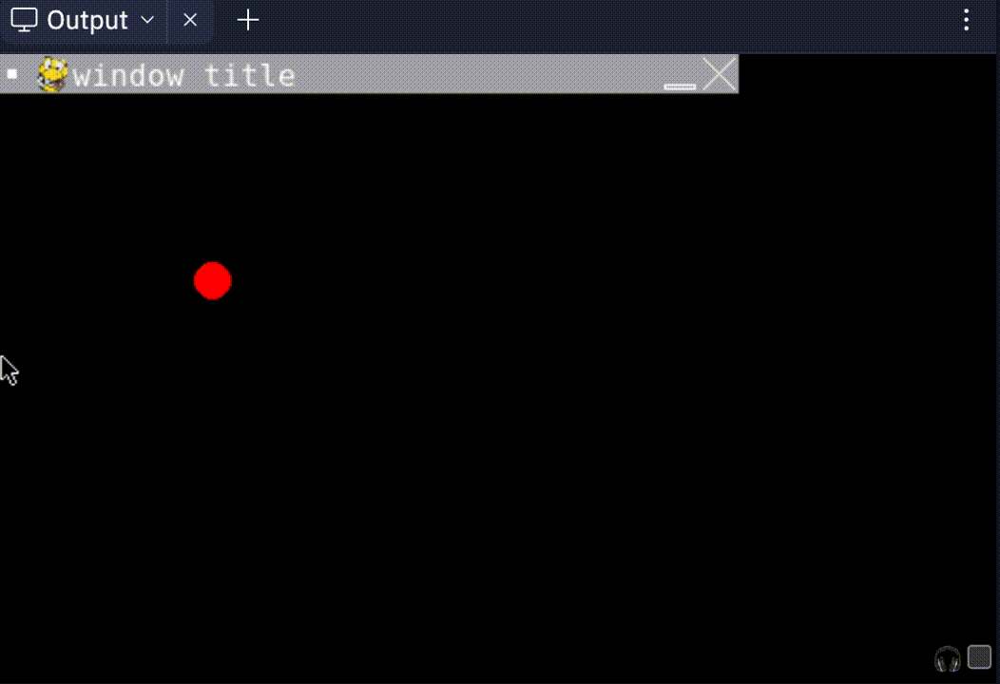
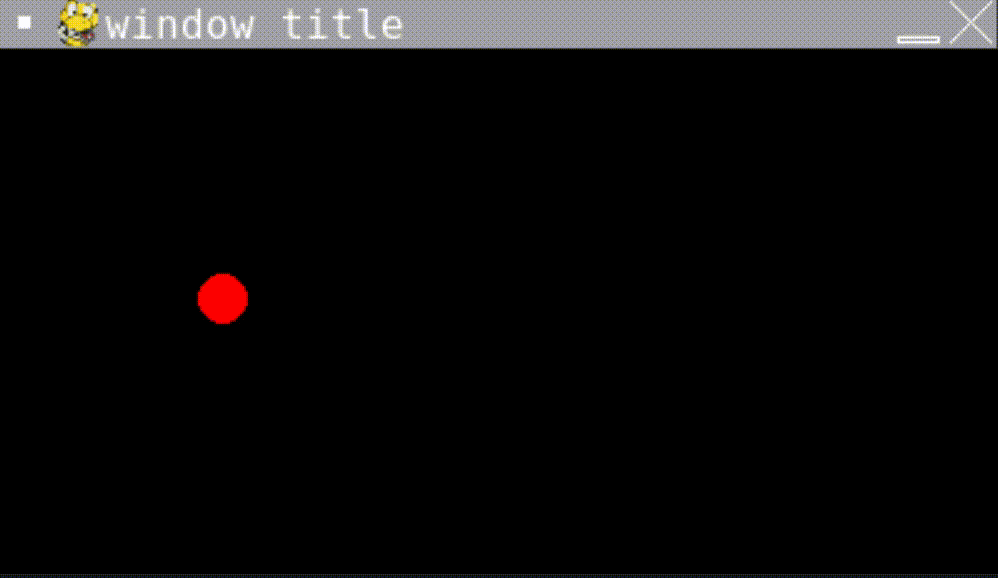

---
jupytext:
  formats: md:myst
  text_representation:
    extension: .md
    format_name: myst
rise:
  start_slideshow_at: beginning

kernelspec:
  display_name: Python 3
  language: python
  name: python3
---

# 作业 #

作业一：完成[intro](intro.md)中的Ex1, Ex2, Ex3，回答下面问题：

a. Ex1中，负责设置窗口标题和窗口颜色的代码分别是哪条？如果想要将窗口颜色设置为红色，应该如何修改代码？

b. Ex2中是怎么监测到按下鼠标按键这个事件的？请指出相应代码。

c. Ex3中是如何监测鼠标移动的？请指出相应代码。

d. 将Ex3的FPS设置为1，重新运行代码后观察运行结果。描述区别并解释原因。

e. 如果将Ex3中的width和height设置为400和400，程序运行可能会报错。请说明原因。

作业二：添加功能：如果鼠标碰到窗口边缘，则游戏退出。在Ex3代码上进行修改。

作业三：运行https://replit.com/@scls-cs/Circle0代码，窗口会出现一个红色小球。请指出显示小球的代码，查阅资料说明四个参数分别代表什么。

作业四：在Circle0基础上修改代码，使得红色小球可以向右移动，碰到窗口的右侧边界游戏结束。

作业五：在Circle0基础上修改代码，使得红色小球在游戏窗口左右两边来回碰撞。不考虑任何能量损失。

## 提交 ##

其中作业一和作业三提交在hw.txt中，作业二和作业五提交在main.py里。

提交链接：https://replit.com/team/SCLS-CS2022/HW1
