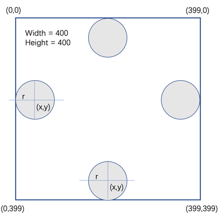

---
jupytext:
  formats: md:myst
  text_representation:
    extension: .md
    format_name: myst
rise:
  start_slideshow_at: beginning

kernelspec:
  display_name: Python 3
  language: python
  name: python3
---

# 碰撞 #

## 碰撞检测 ##



* 小球与左墙壁碰撞： x-r <= 0

* 小球与右墙壁碰撞： x+r >= Width

* 小球与上方碰撞：   y-r <= 0

* 小球与下方碰撞：   y + r >= HEIGHT

## 小球碰撞后速度变化 ##

如果小球沿水平或者垂直方向运动，碰到墙壁后会反弹：速度方向变化，大小不变。

如果小球沿着斜线运动（例如45度），碰到墙壁后：

* 小球与左墙壁碰撞：vx = -vx, vy = vy

* 小球与右墙壁碰撞：vx - -vx, vy = vy

* 小球与上方碰撞：vx = vx, vy = -vy

* 小球与下方碰撞：vx = vx, vy = -vy

代码示例：

```{code-cell} python3
while running:
    clock.tick(FPS)
    for event in pygame.event.get():
        if event.type == pygame.QUIT:
            running = False
    screen.fill((10, 10, 10))
    x += vx/FPS
    y += vy/FPS

    if x - r <= 0 or x + r >= width-1:
        leftrightcollision = True
    if y - r <= 0 or y + r >= height-1:
        updowncollision = True

    if leftrightcollision:
        vx = -vx
        leftrightcollision = False
    if updowncollision:
        vy = -vy
        updowncollision = False
```

## 按键操纵 ##

我们可以通过按键操纵屏幕上物体的移动：

```{code-cell} python3
PADDLE_WIDTH = 80
PADDLE_HEIGHT = 15
PADDLE_COLOR = (255, 0, 0)
paddle_x = 50
paddle_y = height - 10
paddle_speed = 100

while running:
    clock.tick(FPS)
    for event in pygame.event.get():
        if event.type == pygame.QUIT:
            running = False
    keys = pygame.key.get_pressed()
    if keys[pygame.K_LEFT] and paddle_x > 0:
        paddle_x -= paddle_speed/FPS
    if keys[pygame.K_RIGHT] and paddle_x+PADDLE_WIDTH < width-1:
        paddle_x += paddle_speed/FPS
    screen.fill((10, 10, 10))
    pygame.draw.rect(screen, PADDLE_COLOR, (paddle_x, paddle_y, PADDLE_WIDTH, PADDLE_HEIGHT))
    pygame.display.flip()
```

* `keys = pygame.key.get_pressed()`: 获取当前按下的所有键，并将它们存储在变量keys中

* `if keys[pygame.K_LEFT] and paddle_x > 0:`：检查左箭头键是否被按下，以及球拍的x坐标是否大于0。如果满足条件，表示挡板可以向左移动
* 
* `paddle_x -= paddle_speed`：更新球拍的x坐标，使其向左移动paddle_speed个单位。
  
* `if keys[pygame.K_RIGHT] and paddle_x+PADDLE_WIDTH < width-1:`：检查右箭头键是否被按下，以及球拍的x坐标是否小于width-1-- PADDLE_WIDTH。如果满足条件，表示挡板可以向右移动。

* `paddle_x += paddle_speed`：更新挡板的x坐标，使其向右移动paddle_speed个单位。

* `screen.fill(x)`：使用某种颜色清空屏幕，准备绘制新的游戏画面。
  
* `pygame.draw.rect(screen, PADDLE_COLOR, (paddle_x, paddle_y, PADDLE_WIDTH, PADDLE_HEIGHT))`：在屏幕上绘制球拍。使用PADDLE_COLOR颜色，位置为(paddle_x, paddle_y)，宽度为PADDLE_WIDTH，高度为PADDLE_HEIGHT。

注意：paddle_x和paddle_y是挡板左上角的坐标。
