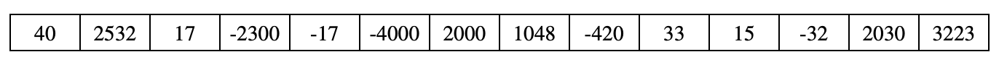

---
jupytext:
  formats: md:myst
  text_representation:
    extension: .md
    format_name: myst
rise:
  start_slideshow_at: beginning

kernelspec:
  display_name: Python 3
  language: python
  name: python3
---

# 列表算法 #

“算法”一词最早出现在《周髀算经》这本书中，对应的单词是“algorism”（由9世纪的波斯数学家阿尔·霍瓦里兹米提出），代指阿拉伯数字的运算规则。随着计算机的快速发展，“算法”被赋予了新的含义，代指解决问题的方法，对应的英文单词演变为“algorithm”。

在计算机里，算法通常指解决某一问题的具体步骤：先做什么，再做什么，最后做什么，计算机只需要依照步骤运行，就可以解决问题。

列表中常见的算法包括：

* 找出列表元素极值，例如最大值和最小值
* 对列表元素进行统计，例如求和、求平均值
* 统计符合特征的元素个数
* 判断是否数组中存在元素符合某种特征
* 判断是否数组中的所有元素都符合某种特征

这些算法通常具有固定的模式：

1. 从列表第一个元素开始进行顺序遍历(sequential iteration)
2. 依次检查每一个元素
3. 对元素进行一些操作
   比较/筛选
   （或）加到某一个变量上
4. 持续遍历列表直到
   找到符合条件的元素
   （或）遍历到列表末尾

## 寻找极值 ##
下面代码用来打印a_list中元素的最大值：

```{code-cell} python3
a_list = [1,3,7,2,4]

a_max = a_list[0]

for i in range(len(a_list)):
    if(a_list[i]> a_max):
        a_max = a_list[i]
        
print(a_max)
```
我们也可以将它写成函数形式：

```{code-cell} python3
def find_max(l):
    result = l[0]
    for i in range(len(l)):
        if(l[i]> result):
            result = l[i]
    return result

print(find_max([1,3,7,2,4]))
```

## 列表元素求和 ##

```{code-cell} python3
def get_sum(l):
    sum = 0
    for i in range(len(l)):
        sum = sum+l[i]
    return sum
print(get_sum([1,3,7,2,4]))
```

## 统计符合某种特征的元素个数 ##

Exercise: 统计列表中的偶数个数

```{code-cell} python3
def count_even(l):
    count = 0
    for i in range(len(l)):
        if(l[i] % 2 == 0):
            count=count+1
    return count

print(count_even([1,3,7,2,4]))
```

## 统计符合某种特征的元素个数 ##
如何判断列表中所有元素均为偶数？

我们可以遍历列表，如果发现有元素是奇数，则直接返回False；如果所有元素都遍历完毕，函数依然没有返回，则说明所有元素均为偶数，函数返回True。

```{code-cell} python3
def all_even(l):
    for i in range(len(l)):
        if(l[i] % 2 != 0):
            return False
    return True
print(all_even([2, 0, 3,4])) 
```

"判断列表中的所有元素都符合X特征"，这类问题算法如下：

1. 顺序遍历列表，如果找到一个反例（不符合X特征），则直接返回False

2. 如果列表遍历结束，函数依然没有返回，则说明所有元素均符合X特征，函数返回True

### Execise ###
问题：编写函数，判断列表是否严格单调递增。

```{code-cell} python3
def check(l):
    #Add code here
    
    
    
print(check([1,3,7,24,28]))  #True
print(check([1,3,7,4]))	     #False

```

## Sound ##

Digital sounds can be represented as a list of integer values. The volume of a sound depends on the amplitude of each value in the sound. The amplitude of a value is its absolute value. For example, the amplitude of -20 is 20, and the amplitude of 40 is 40.

### Part(a) ###

High level of volume can damage your hearing. Write a function **isSafe(sound)** that will determine if the amplitude of any value in the list of sound is below 1000. 

For example, **isSafe([500, 450, -50, 250])** will return True, while **ifSafe([1020, 80, -200])** will return False.

```{code-cell} python3
def isSafe(sample):
    #Add code here
    
    
    
    
    
    
print(isSafe([500, 450, -50, 250]))  #True
print(check([1020, 80, -200]))	     #False

```

### Part(b) ###

Write a function **countNoise(sample, limit)** that will return the total number of values in a sample that were greater than limit, or less than -limit. For example, assume that the sample has been initialized with the following values:



When the statement

```python
s = [40, 2532, 17, -2300, -17, -4000, 2000, 1048, -420, 33, 15, -32, 2030, 3223]

count = countNoise(s, 2000)

print(count)
```
is executed, count will be 5, since there are 5 values that are greater than 2000, or less than -2000.

```{code-cell} python3
def countNoise(sample, limit):
    #Add code here
    
    
    
    
    
    
    

s = [40, 2532, 17, -2300, -17, -4000, 2000, 1048, -420, 33, 15, -32, 2030, 3223]
print(countNoise(s, 2000)  #5
```


### Part(c) ###

Write a function **limitAmplitude(sample, limit)** that will change any value that has an amplitude greater than the given limit. Values that are greater than limit are replaced with limit, and values that are less than -limit are replaced with –limit. For example, when

```python
s = [40, 2532, 17, -2300, -17, -4000, 2000, 1048, -420, 33, 15, -32, 2030, 3223]

limitAmplitude(s, 2000)
```

is executed, sample will contain the following values:


```{code-cell} python3
def limitAmplitude(sample, limit):
    #Add code here
    
    
    
    
    
    
    
    
s = [40, 2532, 17, -2300, -17, -4000, 2000, 1048, -420, 33, 15, -32, 2030, 3223]
limitAmplitude(s, 2000)
print(sample) # should print the values as shown above
```


