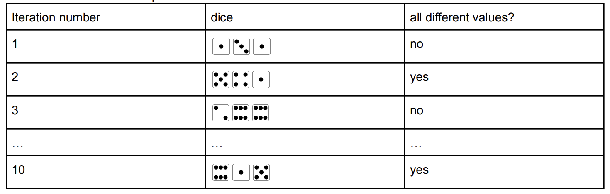

---
jupytext:
  formats: md:myst
  text_representation:
    extension: .md
    format_name: myst
rise:
  start_slideshow_at: beginning

kernelspec:
  display_name: Python 3
  language: python
  name: python3
---

# Problem Set 8 #

## 1. Warming Up ##

This program intends to print the sum of all even digits of an integer. For example, if M is 12345, it wants to print 6, which is 2+4. 

Fix the bug of the program.

```{code-cell} python3

M = 987654321
s = ""
while (M != 0) {
   digit = M % 10
   if(digit%2):
   	s = s + digit
   	s = s + str(digit)
   	M = M / 10
}
print(s)  //should print 20


```

## 2. Check Prime Number ##

A prime number is a number that is only divisible by 1 and itself. The standard method to test to
see if a number is prime or not is to try dividing it by each number starting at 2, to see if there is any remainder or not.

Write a function called checkPrime(n). It will return *True* if n is prime, otherwise return *False*.

```{code-cell} python3

def checkPrime(n):
  #add your code here
  return False

```

You might want to use *break* in the loop, which is to terminate the loop beforehand. For example, the loop terminates when i became 7. You can also solve this problem without using break.

```{code-cell} python3
i = 10
while(i>0):
  if(i == 7):
	break
  print(i)
  i=i-1
```

## 3. Simulation ##

One practical use of computers is that they can be used to simulate items from real life. A nice property of a simulation is that it can be done really quickly and often times is very cheap to do. Actually rolling dice a million times would take a great deal of time! But we can use a loop to easily simulate the case:

```{code-cell} python3
import random
i = 1000000
one=0
two=0
three=0
four=0
five=0
six=0
while(i>0):
	a = random.randint(1,6) #generate a random integer in range [1,6] including 6
	if(a == 1):
		one=one+1
	elif(a == 2):
		two=two+1
	elif(a == 3):
		three=three+1	
	elif(a == 4):
		four=four+1	
	elif(a == 5):
		five=five+1
	else:
		six=six+1
	i=i-1
print("The possibility of getting face 1 is: " + str(one/1000000))	
print("The possibility of getting face 2 is: " + str(two/1000000))	
print("The possibility of getting face 3 is: " + str(three/1000000))	
print("The possibility of getting face 4 is: " + str(four/1000000))	
print("The possibility of getting face 5 is: " + str(five/1000000))	
print("The possibility of getting face 6 is: " + str(six/1000000))	
	
```

Run this program and observe the results. Understanding the code is important to finish the next question.

## 4. Three Dices Problem ##


For this program, you'll write a simulation that repeatedly rolls three 6-sided dice. You'll be calculating how often the three dice all have different values. If you've taken a discrete math or probability course (by no means required!), you may have learned that the theoretical probability of obtaining three different values is $(6*5*4/6^3 = 0.5556)$

This program will calculate the experimental probability of getting three different values for rolling the three dice 10 times, 100 times, 1000 times, and 10000 times.
Consider the case when you roll the dice 10 times. Each time my while loop iterates, you want to roll all three dice once and answer the question "are these all different?".



Example Output:

```
Rolling dice 10 times.
Number of mis-matched rolls: 5
Experimental probability: 0.5

Rolling dice 100 times.
Number of mis-matched rolls: 45
Experimental probability: 0.45

Rolling dice 1000 times.
Number of mis-matched rolls: 555
Experimental probability: 0.555

Rolling dice 10000 times.
Number of mis-matched rolls: 5535
Experimental probability: 0.5535

```

## 5. Optional: Pepys problem ##


In 1693, Samuel Pepys asked Isaac Newton which was more likely: getting at least one 1 when rolling a fair die 6 times or getting at least two 1's when rolling a fair die 12 times. Write a method that uses simulation to determine the correct answer. You need to simulate the game in multiple trials.


## Submission ##

Submit the homework via 钉钉作业本 by Sunday 22PM. 