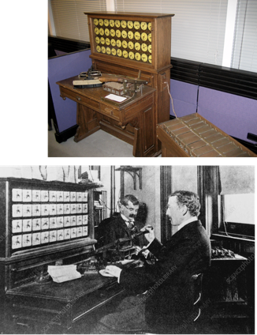

---
jupytext:
  formats: md:myst
  text_representation:
    extension: .md
    format_name: myst
rise:
  start_slideshow_at: beginning

kernelspec:
  display_name: Python 3
  language: python
  name: python3
---

# 计算机的发展史 #

## 早期计算工具 ##

算盘

* 算盘起源于中国，距今已经有2600多年历史

* 上半部每算珠代表5，下半部每算珠代表1

* 从右至左代表了十进制的个、十、百、千、万…

## 文艺复兴时期 ##

这个时期艺术和科技知识大爆炸，数学与科学开始成为最重要的领域。

问题: 怎样才能更有效率的进行计算？

### 普遍认为的第一台计算机 ####

帕斯卡（1623-1662）

* 12岁独自发现了“三角形的内角和等于180度”
* 16岁参加巴黎数学家和物理学家小组
* 17岁写成《圆锥截线论》震惊数学家笛卡尔
* 18岁开始设计计算机，帮助父亲计算税率
* 19岁第三个模型在1642年研制成功

帕斯卡加法器

* 可以直接对两个数字进行加减运算。
* 能通过重复加减运算以达到乘除运算的目的。
* 滚轮式计算器，操作比较繁琐。

### 莱布尼茨 ###

* 1673年他在帕斯卡加法器的基础上，建造了一台能够进行四则运算的计算机器，轰动欧洲
* 计算精度可以达到16位

## 工业革命时期 ##

### 巴贝奇 ###

* 1822年巴贝奇制造出第一台差分机
* 它可以处理3个不同的5位数
* 计算精度达到6位小数

* 1834年提出分析机的概念
* 机器共分为三个部分：堆栈、运算器、控制器
* 企图用机械方式（蒸汽动力）实现一般意义下的计算过程
* 计算用的程序和数据存储在穿孔卡片上

## 机械计算机的不断发展 ##

### 霍列瑞斯 ###

* 源自美国人口普查
* 1880的人口普查1887年才完成
* 1890年的可能需要1900年才能完成
* Hollerith制表机应运而生
* 6个月即完成1890年人口普查数据汇总
* 随后两年完成所有统计工作
* 1896年，Hollerith成立“计算制表记录公司”，1924年改名为“国际商用机器公司”（IBM）

## 普遍认为的第一台计算机 ##

ENIAC（Electronic Numeric Integrator and Computer）

电子数字积分计算机

* 由Upenn摩尔学院莫契利和埃克特设计
* 1943年开始，1945年完成 
* 17468只电子管，7200个二极管，70000多只电阻器，10000多只电容器，电路焊接点50万个 
* 174000瓦功耗 
* 30米长，3米高，30吨重，占地面170平方米 
* 每秒5000次加法，3/1000秒完成两个10位数乘法

## 冯诺依曼：现代计算机之父 ##

1945年3月，伟大的计算机先驱冯诺依曼来到摩尔学院，与莫契利和埃克特进行了两天讨论，拟定了存储程序式的电子计算机的方案。

* EDVAC于1952年制造完成

* 是第一台存储程序式的计算机

* 是现代所有计算机的原型和范本

## 作业 ##

绘制计算机的发展历史。

要求：通过查阅资料和课件来搜集计算机历史的信息，并通过手绘或者电脑设计一幅计算机发展史图。图中需要包括：

1. 时间轴
2. 计算机的起源和早期发展
3. 现代计算机的发展
4. 智能手机和移动设备的发展历史

可以使用铅笔、彩笔或绘图软件设计计算机发展历史的时间轴。通过图像需要反映出每个时期的计算机技术，并使用不同的颜色、符号和其他图形来区分不同的计算机类型和阶段。

在图表或时间轴上需要添加一些注释，以解释每个时期的主要发展趋势、重要事件和技术变革。注释应该简短明了，用语清晰，便于其它同学理解。

参考资料：

The History of Computing: https://www.youtube.com/watch?v=-M6lANfzFsM&t=175s

Evolution of Computers: https://www.youtube.com/watch?v=tw_bsmVYIyM

How an 1803 Jacquard Loom Led to Computer Technology
: https://www.youtube.com/watch?v=MQzpLLhN0fY

Steve Jobs: How a Dreamer Changed the World
: https://www.youtube.com/watch?v=5fI3zz2cp3k

https://limboy.me/posts/computer-history/

https://www.scholat.com/teamwork/showPostMessage.html?id=2833

